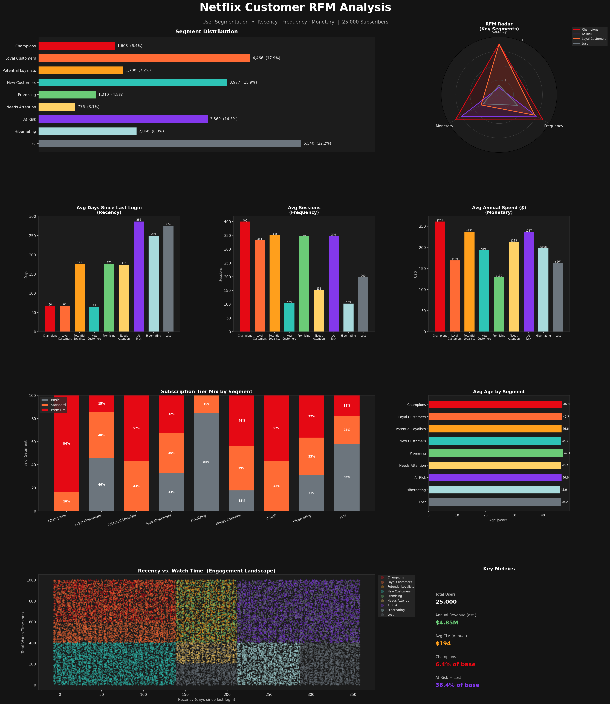
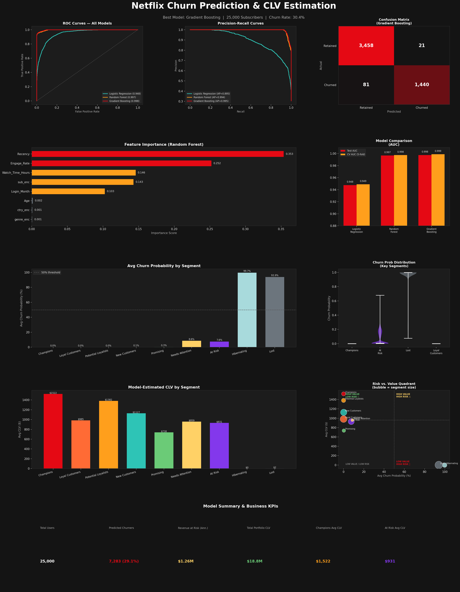

# Netflix Customer Segmentation & Retention Analysis

## Project Overview
End-to-end customer analytics project covering RFM segmentation,
churn prediction, and CLV estimation across 25,000 Netflix subscribers.

## Dashboards

## Methodology
- **RFM Analysis** — 9 behavioral segments via Recency, Frequency, Monetary scoring
- **Churn Prediction** — Logistic Regression, Random Forest, Gradient Boosting (AUC: 0.997)
- **CLV Estimation** — Model-weighted Customer Lifetime Value per segment
- **Business Strategy** — Intervention framework, retention offers, early access targeting

## Key Results
| Segment | Churn Probability | Avg CLV |
|---|---|---|
| Champions | ~0% | $1,522 |
| At Risk | ~7.6% | $930 |
| Hibernating | ~99.7% | ~$0 |
| Lost | ~93.9% | ~$2 |

## Tech Stack
`Python` `Pandas` `Scikit-learn` `Matplotlib` `Google Colab`

## Project Files
| File | Description |
|---|---|
| `notebooks/Netflix_Customer_Segmentation_ipynb` | Full Colab notebook — RFM + Churn + CLV |
| `docs/netflix_business_reasoning.md` | Business interpretation & retention strategy |
| `outputs/` | Dashboards and enriched datasets |
| `data/netflix_users.csv` | Raw dataset — 25,000 subscribers |

## Author
**Lovely Kumari**
MS Business Analytics · University of Arizona
